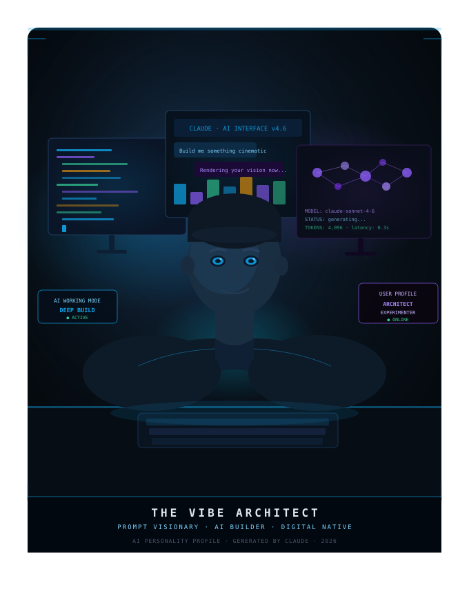

  

---

## Overview

Today I created an AI Personality Profile to understand how I interact with AI tools, learn new skills, and approach building projects.

This profile serves as a baseline for my 60-day AI challenge and will help me track how my thinking, skills, and workflows evolve over time.

---

## My AI Archetype

### The Vibe Architect

*Prompt Visionary • Builder of Digital Experiences • AI-First Thinker*

I approach AI as a collaborator rather than a search engine. My focus is on creating systems, products, and experiences that combine functionality with creativity.

---

## Key Insights

### AI Working Style

* Outcome-focused and project-driven
* Prefer structured, high-signal responses
* Use AI as a collaborator rather than a tool
* Think in systems, products, and execution

### Strengths

* Creative and technical thinking
* Fast idea generation
* Strong curiosity
* Ability to connect concepts across domains
* Learning by building

### Areas for Improvement

* Going deeper before moving to the next project
* Building stronger iteration habits
* Validating AI outputs through technical understanding
* Focusing on effectiveness over aesthetics

### Learning Style

* Visual learner
* Project-based learner
* Reverse-engineers solutions
* Learns through experimentation and execution

---

## Career Directions Identified

* AI Product Builder
* Full-Stack Developer
* AI Startup Founder
* AI Consultant
* Technical Content Creator

---

## Biggest Takeaway

The most valuable insight from this exercise was realizing that my biggest opportunity is not generating more ideas—it's consistently refining and improving the ideas I already have.

The goal for the next 60 days is to focus on execution, iteration, and public documentation of progress.

---

## Challenge Goal

Build, learn, document, and share progress every day for the next 60 days while developing practical AI and software engineering skills.

**Day 01 Status:** ✅ Completed

