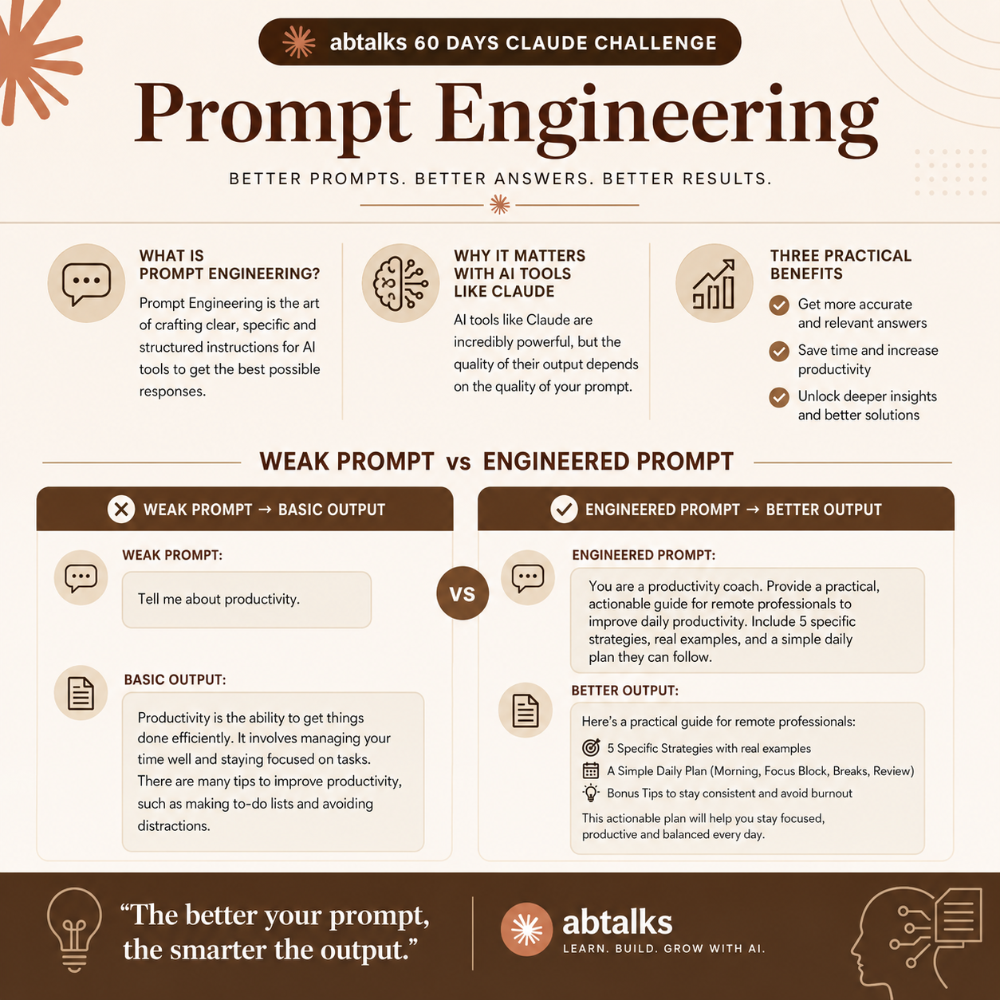

# Day 2 – Introduction to Prompt Engineering

## Overview

Today I learned the fundamentals of Prompt Engineering and why it plays a critical role when working with AI tools such as Claude.

A prompt is anything you type into an AI tool—a question, request, or instruction. Prompt Engineering is the practice of writing those inputs more clearly and intentionally so the AI understands exactly what you need.

It isn't coding. It isn't highly technical. It's communication. Just as a well-written email gets a better response than a vague text message, a well-written prompt gets a better response from AI.

## Why Prompt Engineering Matters

AI models are incredibly capable, but their output depends on the quality of the input.

A vague prompt often leads to a vague answer. When you clearly define your goal, audience, format, and tone, AI becomes less of a guessing machine and more of a productive collaborator.

---

## Weak vs Improved Prompt

### Weak Prompt

> Tell me about leadership.

### Typical Output

A broad, textbook-style explanation of leadership principles. Accurate, but generic and not immediately useful for a specific situation.

 

### Improved Prompt

> I'm a first-time manager at a 10-person startup. Give me 5 practical leadership tips I can apply this week, written in plain language.

### Improved Output

A tailored, actionable list with practical advice such as:

* Conducting effective one-on-one meetings
* Giving clear and constructive feedback
* Setting expectations early
* Building trust within the team
* Communicating priorities effectively

   

---

## Key Benefits of Prompt Engineering

### 1. Faster Results

Clear prompts reduce back-and-forth corrections, helping you get useful answers more quickly.

### 2. More Relevant Responses

Providing context such as your role, audience, or objective helps AI generate outputs that fit your specific needs.

### 3. Better Use of AI Capabilities

Well-crafted prompts unlock advanced capabilities such as:

* Structured writing
* Research assistance
* Brainstorming
* Analysis
* Learning support
* Coaching

---

## Key Takeaway

The quality of an AI's response is often determined by the quality of the prompt. Learning to communicate clearly with AI is one of the most valuable skills for anyone using modern AI tools.

---

**Day 2 Complete ✅**
