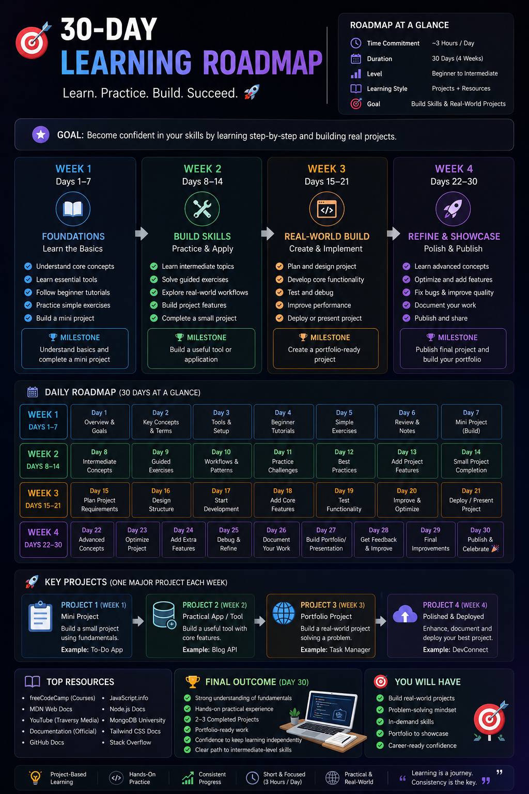
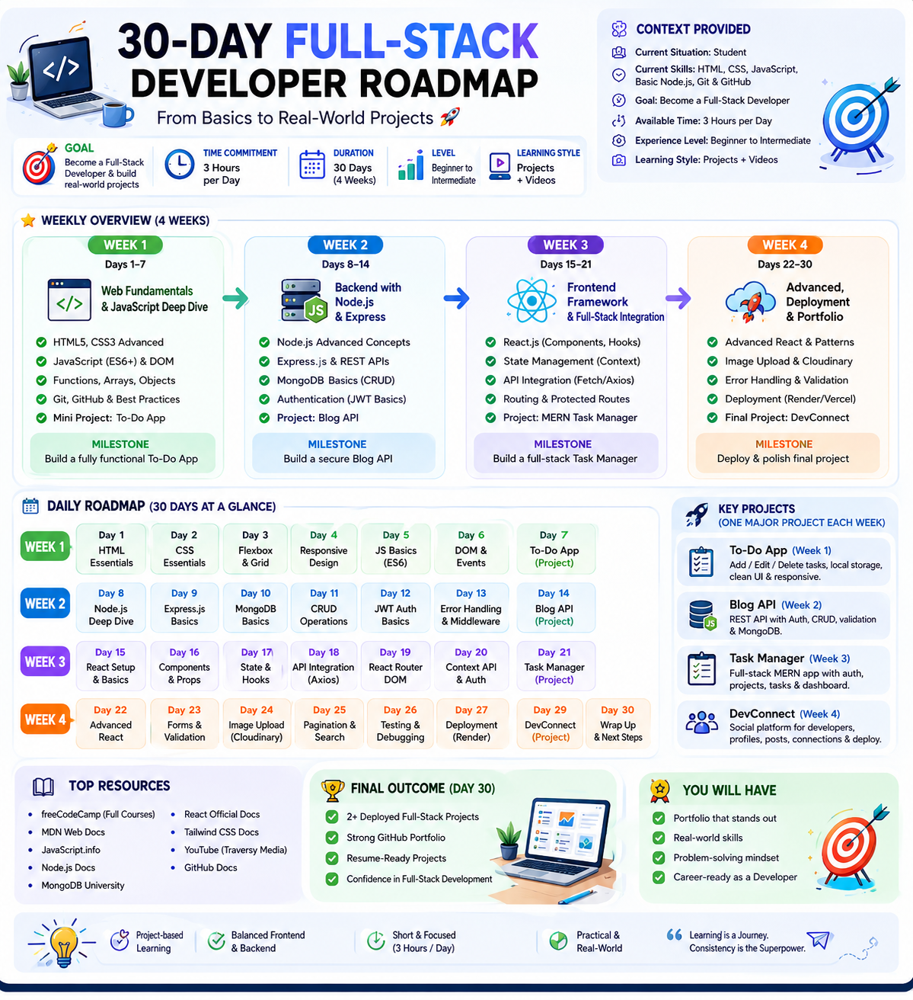

# 🚀 Day 5/60 – Context Engineering

## 🎯 Objective

Learn how Context Engineering helps AI generate more accurate, personalized, and actionable outputs by providing relevant background information before asking a question.

---

## 📖 What is Context Engineering?

Context Engineering is the practice of giving AI sufficient background information, constraints, goals, and personal details so it can generate highly relevant and customized responses.

Instead of asking a generic question, you provide context about:

* Your current situation
* Existing skills
* Goals
* Available time
* Experience level
* Preferred learning style

This allows AI to create responses specifically tailored to your needs.

### Benefits of Context Engineering

✅ More personalized outputs

✅ Better recommendations

✅ Reduced generic responses

✅ Improved learning roadmaps

✅ More practical action plans

---

## 📝 Prompt Used

### Prompt A (Without Context)

Create a 30-day learning roadmap.

Include:

* Weekly milestones
* Daily tasks
* Resources
* Projects
* Final outcome

Make it practical and beginner-friendly.

---

### Prompt B (With Context)

Create a 30-day learning roadmap.

Context:

* Current Situation: Student
* Current Skills: HTML, CSS, JavaScript, Basic Node.js, Git & GitHub
* Goal: Become a Full-Stack Developer and build real-world projects
* Available Time: 3 Hours per Day
* Experience Level: Beginner to Intermediate
* Preferred Learning Style: Projects + Videos

Include:

* Weekly milestones
* Daily tasks
* Resources
* Projects
* Final outcome

Make it practical and beginner-friendly.

---

## 🔍 Comparison Results

### Output A (Without Context)

The roadmap was:

* Generic
* Suitable for a wide audience
* Lacked personalization
* Did not consider existing skills
* Did not account for available time
* Focused mainly on learning technologies

 
 
---

### Output B (With Context)

The roadmap was:

* Personalized to my current skills
* Focused on Full-Stack Development
* Structured around 3 hours/day
* Included project-based learning
* Recommended practical projects
* Aligned with my career goal

   

---

## 🗺️ Personalized 30-Day Roadmap

### Week 1 (Days 1–7)

#### Web Fundamentals & JavaScript Deep Dive

Topics:

* HTML5 & Advanced CSS3
* JavaScript ES6+
* DOM Manipulation
* Functions, Arrays & Objects
* Git & GitHub Best Practices

Project:
✅ To-Do App

Milestone:
Build a fully functional To-Do application.

---

### Week 2 (Days 8–14)

#### Backend with Node.js & Express

Topics:

* Node.js Fundamentals
* Express.js
* REST APIs
* MongoDB Basics
* CRUD Operations
* JWT Authentication

Project:
✅ Blog API

Milestone:
Build a secure REST API with authentication.

---

### Week 3 (Days 15–21)

#### React & Full-Stack Integration

Topics:

* React Components
* State & Hooks
* API Integration
* React Router
* Authentication Flow

Project:
✅ MERN Task Manager

Milestone:
Build a complete full-stack task management application.

---

### Week 4 (Days 22–30)

#### Deployment & Portfolio Building

Topics:

* Advanced React
* Cloudinary
* Error Handling
* Deployment (Render/Vercel)
* Portfolio Optimization

Project:
✅ DevConnect

Milestone:
Deploy and polish the final project.

---

## 💼 Projects Built

### 1️⃣ To-Do App

* Add/Edit/Delete Tasks
* Local Storage
* Responsive Design

### 2️⃣ Blog API

* CRUD Operations
* JWT Authentication
* MongoDB Integration

### 3️⃣ MERN Task Manager

* Authentication
* Dashboard
* Task Management

### 4️⃣ DevConnect

* Developer Profiles
* Social Features
* Full Deployment

---

## ✅ Outcome

Successfully used Context Engineering to generate a highly personalized 30-day Full-Stack Developer Roadmap and learned how providing relevant background information significantly improves the quality, accuracy, and usefulness of AI-generated responses.
